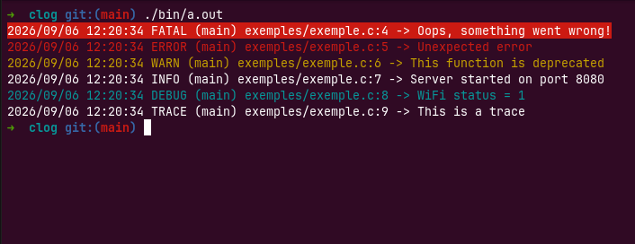

# CLOG - A simple log library

Clog is a simple log library easy to use in your C programs.

## Features

- log levels (TRACE, DEBUG, INFO, WARN, ERROR, FATAL)
- no external dependencies
- supports ANSI color

## Installation

Copy `clog.h` into your project and include it:

```c
#include "clog.h"
```

## API 

| Macro | Description |
|---|---|
| `CLOG_TRACE(fmt, ...)` | Log a trace message |
| `CLOG_DEBUG(fmt, ...)` | Log a debug message |
| `CLOG_INFO(fmt, ...)` | Log an info message |
| `CLOG_WARN(fmt, ...)` | Log a warning message |
| `CLOG_ERROR(fmt, ...)` | Log an error message |
| `CLOG_FATAL(fmt, ...)` | Log a fatal message |

| Function | Description |
|---|---|
| `clog_set_output(FILE* out)` | Redirect all log output to a custom stream (defaults to ` stdout` / `stderr` depending on level) |

## Usage

```c
#include "clog.h"

#define TAG "main"

int main(void) {
    CLOG_FATAL(TAG, "Oops, something went wrong!");
    CLOG_ERROR(TAG, "Unexpected error");
    CLOG_WARN(TAG, "This function is deprecated");
    CLOG_INFO(TAG, "Server started on port %s", "8080");
    CLOG_DEBUG(TAG, "WiFi status = %d", 1);
    CLOG_TRACE(TAG, "This is a trace");
    return 0;
}
```

## Example



## Licence

This project is licensed under the MIT License - see the [LICENSE](LICENSE) file for details